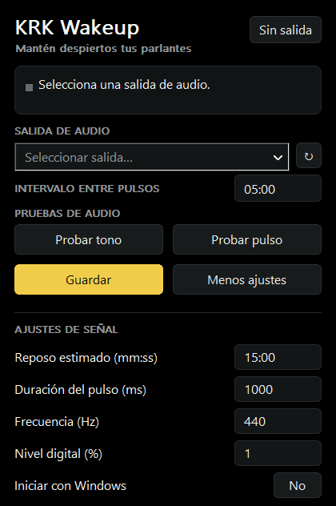

<p align="center">
  
</p>

<p align="center">
  <a href="README.md">Español</a> · <a href="README.en.md">English</a>
</p>

<p align="center">
  <a href="LICENSE"></a>
  
  
  
  
  
  
</p>

**KRK Wakeup** is a small Windows utility that sends a short audio signal to an output you choose. It was created to prevent KRK GoAux 3 speakers connected over RCA to an SMSL SU-1 from entering standby during long pauses.

> **Status:** v0.1.1 is released. The Windows build and startup check passed; the pulse's effectiveness is still being tested on physical speakers. In one trial the GoAux stayed on for about 45 minutes, but they went to sleep with a 20-minute pulse interval. An initial test at an 18-minute interval kept the speakers awake; longer observation is still needed. No pulse profile has yet been documented and repeated over several hours.

<p align="center">
  
</p>

## Interface

<p align="center">
  
</p>

<details>
<summary>View signal settings</summary>

<p align="center">
  
</p>

</details>

These are captures of the actual Windows interface with no audio output selected. Sharpness at 4K depends on Windows DPI scaling; a physical 4K monitor check is still pending.

## Why it exists

GoAux speakers can enter standby after receiving no signal for some time. In this setup, standby was initially estimated at **about 15 minutes**. Failure with a 20-minute pulse interval shows that interval leaves insufficient margin, but does not establish the exact standby time. The [official KRK manual](https://cdn.shopify.com/s/files/1/0566/0809/6342/files/KRK-GoAux-Monitor-System-Product-User-Manual.pdf?v=1705178896) explains how to control standby manually, but does not specify the automatic standby interval or the minimum signal level that resets it. Both need to be checked with the actual speakers.

The idea is simple: while the utility is active, it sends a discreet pulse before the speakers go to sleep. The default test interval is **5 minutes**, and you can change it.

## Features

- A notification area icon next to the Windows clock and a compact OLED black window. Audio tests, main actions, and advanced settings are grouped separately. Fonts and controls scale with each monitor’s DPI for sharp rendering on high-resolution displays; visual validation on a real 4K monitor is still pending.
- A fixed audio output: changing the Windows default output to Bluetooth headphones does not change where the pulse goes.
- A three-second audible test tone (440 Hz at 5% digital level), a test of the configured pulse, pause, an adjustable interval, and a countdown to the next pulse.
- Additional settings for estimated standby time, pulse duration, frequency, and digital level.
- Optional startup when the current user signs in to Windows, without an installer or administrator rights.
- Wait and retry when the selected output disappears; pulses are never redirected automatically to another output.

The initial target setup is **Windows 11 x64 → USB → SMSL SU-1 → RCA → KRK GoAux 3**. Windows 10 is a later compatibility goal and still requires testing.

## Download and test

1. Open [Releases](https://github.com/reiterstahl/krk-wakeup/releases), download **`krk-wakeup-v0.1.1-windows-x64.zip`** from **v0.1.1**, and extract its contents to a stable folder. It includes `krk-wakeup.exe`, the license, and documentation. Development builds remain available in [Windows build](https://github.com/reiterstahl/krk-wakeup/actions/workflows/windows.yml).
2. If an older version is running, choose **Salir** (Exit) from its notification area menu before replacing the `.exe`. Your settings will remain in place.
3. Open the app and select the playback output corresponding to the **SMSL SU-1**. You can compare its name with **Settings → System → Sound** in Windows.
4. Set the GoAux speakers to a comfortable volume, then click **Probar tono** (Test tone). It plays for three seconds at 440 Hz and 5% digital level only through the selected output, even if the app is paused. Confirm that you hear it on the GoAux and nowhere else. Next, click **Probar pulso** (Test pulse): it uses the configured automatic signal, initially **440 Hz**, **1000 ms**, and **1%** digital level. Change these values under **Más ajustes** (More settings) if the signal is annoying or fails to prevent standby.
5. Save your settings. Switch the Windows default output to Bluetooth headphones and confirm the test still plays only through the DAC. Then leave the GoAux without other audio for longer than their usual standby time and check whether they remain active.

Time fields use `mm:ss`. **Reposo estimado** (Estimated standby) is a calibration reference; it does not change the KRK speakers' internal timer. **Intervalo entre pulsos** (Pulse interval) controls when the app sends audio. The app warns you if the interval equals or exceeds the estimated standby time.

**Frecuencia** (Frequency) accepts **10 to 15000 Hz**. To try a low frequency, use **Probar pulso** (Test pulse), which plays your configured settings. **Probar tono** (Test tone) remains the fixed audible test at 440 Hz. Low frequencies are experimental: their effectiveness at preventing standby still needs to be checked on the GoAux.

A **20-minute** interval did not prevent standby in the tested GoAux; **18 minutes** worked in an initial trial, but needs longer observation. For now, the default **5-minute** interval leaves more margin relative to the estimated 15-minute standby time. If they go to sleep even with a short interval, use **Probar tono** (Test tone) to confirm the audio route, then change pulse level and duration one at a time. KRK does not publish the GoAux detection threshold in its manual. Also check that neither Windows nor the SMSL SU-1 is muted.

**Locking Windows with Win + L** leaves the utility running while the computer remains awake. If Windows enters sleep or hibernation, desktop processes pause and pulses resume when the computer wakes. See [Microsoft's sleep documentation](https://learn.microsoft.com/en-us/windows-hardware/design/device-experiences/integrating-apps-with-modern-standby).

## Start with Windows

The executable is portable. Extract it to a folder where it will stay. In the app, open **Más ajustes** (More settings), switch **Iniciar con Windows** (Start with Windows) to **Sí** (Yes), and click **Guardar** (Save). The app writes the full `.exe` path to the [current user's `Run` key](https://learn.microsoft.com/en-us/windows/win32/setupapi/run-and-runonce-registry-keys); Windows launches it whenever you sign in to that account. No installer is needed, and this option is off by default. Startup registration is implemented, but it has not yet been checked after a fresh sign-in on the test machine.

If you later move or rename the executable, turn the option off and save, then turn it on and save again to register the new path. You can disable startup the same way. Settings are stored separately at `%LOCALAPPDATA%\KRKWakeup\settings.ini`.

## How it works

The app uses the [Windows audio device API](https://learn.microsoft.com/en-us/windows/win32/coreaudio/getting-the-default-device-endpoint-for-stream-routing) to save the selected output's identifier and open that output directly. It generates a short waveform with smooth fade-in and fade-out through [WASAPI shared mode](https://learn.microsoft.com/en-us/windows/win32/coreaudio/wasapi). Regular audio and Bluetooth headphones can coexist with the utility.

With this analog connection, Windows identifies the **SMSL SU-1**, not the speakers attached to its RCA outputs. The app can detect when the USB DAC disappears, but it cannot detect an unplugged RCA cable or powered-off GoAux speakers. Nor can software confirm that a pulse reset the speakers' internal standby timer: that must be checked on the speakers themselves.

The window and notification area icon use Win32, with a Per-Monitor V2 manifest and DPI scaling for fonts, controls, and drawing; audio uses WASAPI; builds use CMake and MSVC. The executable links the C++ runtime statically. The app needs no administrator privileges and does not modify the speakers' firmware.

## Build

Install Visual Studio 2022 with **Desktop development with C++** and CMake. In PowerShell:

```powershell
cmake -S . -B build -A x64
cmake --build build --config Release
```

The executable will be at `build\Release\krk-wakeup.exe`. Every change to `main` triggers a build and startup smoke test in GitHub Actions. This test does not measure physical standby behavior; the [validation plan](docs/PLAN.md) describes that check (currently in Spanish).

## Project

KRK Wakeup is free and open-source software under the [MIT license](LICENSE), with copyright held by **reiterstahl**. You may use, modify, and redistribute the software, including commercially, provided you retain the copyright notice and license. The software is provided without warranty.

KRK Wakeup is an independent project and is not affiliated with KRK, Gibson, or SMSL.
