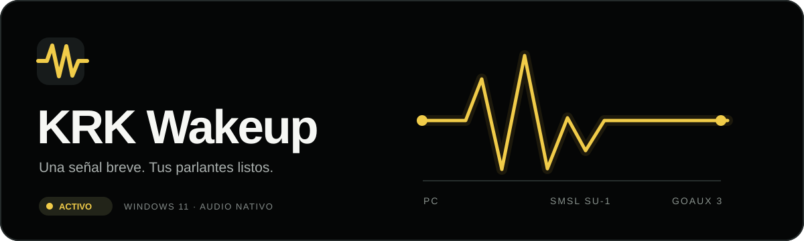
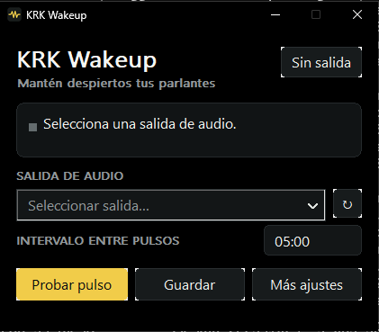

<p align="center">
  
</p>

<p align="center">
  <a href="README.md">Español</a> · <a href="README.en.md">English</a>
</p>

<p align="center">
  
  
  
  
  
  
</p>

**KRK Wakeup** es una utilidad pequeña para Windows que envía una señal de audio breve a una salida elegida por el usuario. Nació para evitar que unos KRK GoAux 3 conectados por RCA a un SMSL SU-1 entren en reposo durante pausas largas.

> **Estado:** prototipo funcional. La compilación y el arranque están comprobados en el flujo de Windows; la eficacia del pulso y su audibilidad se están probando con los parlantes reales.

<p align="center">
  
</p>

<p align="center">
  
</p>

## Por qué existe

Los GoAux pueden entrar en reposo cuando llevan un tiempo sin recibir señal. En este equipo, el tiempo observado se estima inicialmente en **15 minutos**. El [manual oficial de KRK](https://cdn.shopify.com/s/files/1/0566/0809/6342/files/KRK-GoAux-Monitor-System-Product-User-Manual.pdf?v=1705178896) explica cómo controlar el reposo manualmente, pero no especifica el intervalo de reposo automático ni el nivel mínimo de señal que lo reinicia. Por eso ambos parámetros se validan en el equipo real.

La idea es sencilla: mientras la utilidad esté activa, genera un pulso discreto antes de que los parlantes se duerman. El intervalo predeterminado para las pruebas es **5 minutos** y se puede ajustar.

## Qué ofrece

- Icono junto al reloj de Windows y una ventana compacta con tema negro OLED.
- Salida de audio fija: cambiar la salida predeterminada a auriculares Bluetooth no cambia el destino del pulso.
- Prueba de tono audible de 3 segundos (440 Hz, 5 % de nivel digital), prueba del pulso configurado, pausa, intervalo configurable y cuenta regresiva del siguiente envío.
- Ajustes ampliables de reposo estimado, duración, frecuencia y nivel digital de la señal.
- Inicio opcional con Windows para la cuenta de usuario actual.
- Espera y reintento cuando desaparece la salida seleccionada; nunca redirige los pulsos automáticamente a otra salida.

El alcance inicial es **Windows 11 x64 → USB → SMSL SU-1 → RCA → KRK GoAux 3**. Windows 10 queda como objetivo de compatibilidad posterior, sujeto a pruebas.

## Descargar y probar

1. En [Windows build](https://github.com/reiterstahl/krk-wakeup/actions/workflows/windows.yml), abre la última ejecución exitosa y descarga el artefacto **`krk-wakeup-windows-x64`**. Extrae `krk-wakeup.exe` en una carpeta estable.
2. Si ya ejecutas una versión anterior, usa **Salir** en su icono junto al reloj antes de reemplazar el archivo `.exe`. La configuración se conserva.
3. Abre la aplicación y selecciona la salida de reproducción que corresponde al **SMSL SU-1**. Puedes comparar su nombre con **Configuración → Sistema → Sonido** de Windows.
4. Con un volumen cómodo en los GoAux, pulsa **Probar tono**. Reproduce 3 segundos a 440 Hz y 5 % de nivel digital solo por la salida seleccionada, incluso si la aplicación está pausada. Confirma que se oye en los GoAux y no en otro dispositivo. Después, pulsa **Probar pulso**: usa la señal automática configurada, cuyo perfil inicial es **440 Hz**, **1000 ms** y **1 %** de nivel digital. Ajusta estos valores en **Más ajustes** si la señal molesta o no evita el reposo.
5. Guarda la configuración. Cambia la salida predeterminada de Windows a tus auriculares BT y comprueba que la prueba sigue saliendo solo por el DAC. Después, deja los GoAux sin otro audio durante más de su tiempo habitual de reposo y observa si permanecen activos.

Los campos de tiempo usan `mm:ss`. **Reposo estimado** sirve de referencia para calibrar; no modifica el temporizador interno de los KRK. **Intervalo entre pulsos** controla el envío real. Si el intervalo iguala o supera el reposo estimado, la app muestra un aviso.

**Frecuencia** acepta de **10 a 15000 Hz**. Para ensayar una frecuencia baja, usa **Probar pulso**, que reproduce tus ajustes. **Probar tono** sigue siendo la prueba audible fija de 440 Hz. Las frecuencias bajas son experimentales: su eficacia para evitar el reposo aún debe comprobarse en los GoAux.

Si los GoAux siguen entrando en reposo pese a los pulsos de 5 minutos, comprueba primero con **Probar tono** que la ruta hasta los parlantes funciona. Después prueba el pulso con un nivel digital de **3 %** y una duración de **2000 ms**, manteniendo los 5 minutos entre pulsos. Si sigue sin funcionar, prueba **5 %** y observa al menos dos periodos completos de reposo. Reduce el nivel si se vuelve molesto. El umbral interno de detección de los GoAux no está publicado en su manual, así que estos valores son una propuesta de prueba, no una garantía. También revisa que Windows y el SMSL SU-1 no estén silenciados.

**Al bloquear Windows con Win + L**, la utilidad sigue ejecutándose mientras el equipo permanezca encendido. Si Windows entra en suspensión o hibernación, los procesos de escritorio se pausan y los pulsos se reanudan al volver. [Documentación de Microsoft sobre suspensión](https://learn.microsoft.com/en-us/windows-hardware/design/device-experiences/integrating-apps-with-modern-standby).

## Cómo funciona

La aplicación usa la [API de dispositivos de audio de Windows](https://learn.microsoft.com/en-us/windows/win32/coreaudio/getting-the-default-device-endpoint-for-stream-routing) para guardar el identificador de la salida seleccionada y abrirla directamente. El generador envía una onda breve con entrada y salida suaves mediante [WASAPI en modo compartido](https://learn.microsoft.com/en-us/windows/win32/coreaudio/wasapi). El audio normal y los auriculares BT pueden convivir con la utilidad.

En esta conexión analógica Windows identifica el **SMSL SU-1**, no los parlantes conectados al otro extremo de los RCA. Puede detectar si desaparece el DAC USB, pero no si se retira solo el cable RCA o se apagan los GoAux. Tampoco puede confirmar por software que un pulso haya reiniciado el temporizador interno de los parlantes: eso se comprueba observándolos.

La ventana y el icono usan Win32; el audio, WASAPI; la compilación, CMake y MSVC. El ejecutable enlaza el runtime de C++ estáticamente. Los ajustes se guardan en `%LOCALAPPDATA%\KRKWakeup\settings.ini`; el inicio opcional utiliza `HKCU\Software\Microsoft\Windows\CurrentVersion\Run`. La aplicación no requiere privilegios de administrador ni modifica el firmware de los parlantes.

## Compilar

Instala Visual Studio 2022 con **Desktop development with C++** y CMake. En PowerShell:

```powershell
cmake -S . -B build -A x64
cmake --build build --config Release
```

El archivo estará en `build\Release\krk-wakeup.exe`. Cada cambio en `main` ejecuta la compilación y una prueba de arranque en GitHub Actions. Esta prueba no mide el reposo físico; los [pasos de validación](docs/PLAN.md) describen esa comprobación.

## Proyecto

El repositorio es público para compartir el prototipo y sus pruebas. Aún no se ha elegido una licencia de código abierto; hasta entonces, la publicación del código no concede permisos adicionales de uso o redistribución. KRK Wakeup es un proyecto independiente y no está afiliado a KRK, Gibson ni SMSL.
